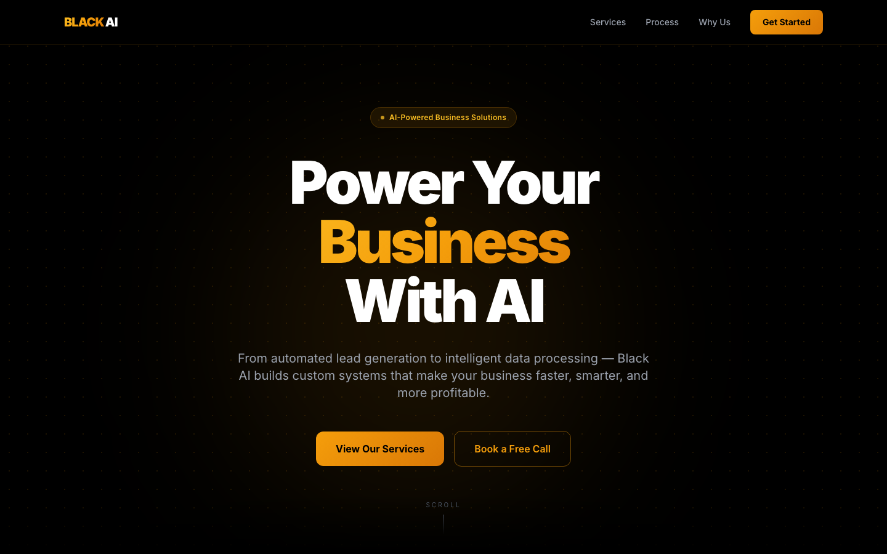

# Black AI

A single-page marketing site for an AI services agency, built with Next.js 14 and Tailwind CSS.



## What's in it

One page, composed of small React components in `app/page.tsx`:

- **Navbar:** fixed to the top with a backdrop blur, plus a mobile menu that toggles open and closed
- **Hero:** headline, supporting copy, and two calls to action
- **Services:** six service cards (AI workflow automation, website development, AI business integration, AI lead generation, data processing and analytics, system cleanup and optimization), driven by a `SERVICES` data array
- **Process:** four numbered steps (Discovery, Strategy, Build, Optimize), driven by a `STEPS` array
- **Why Us:** a results and stats block
- **CTA and footer:** a closing call to action with a `mailto:` link

Content lives in plain data arrays at the top of the file, so copy changes don't touch the layout code.

## Design

- Black and amber palette with a subtle dot-grid background and radial glow in the hero
- Custom `btn-gold` and `btn-outline` button styles defined in `globals.css`
- Fully responsive, with a mobile-first layout and a collapsing nav
- SVG icons are inline components, so there are no icon-library dependencies
- Inter via `next/font` (self-hosted, no layout shift)

## Run it

Requires Node 18+.

```bash
npm install
npm run dev
```

Open http://localhost:3000.

## Notes

- The stats in "Why Us" (for example "3× Average Lead Increase") are **placeholder marketing copy, not measured results**. Replace them with real numbers before using this for a real business.
- The contact address (`hello@blackai.com`) is a placeholder, and there's no form or backend; the CTA is a `mailto:` link.
- No automated tests. It's a static presentation page.

## Tech

Next.js 14 (App Router) · React 18 · TypeScript · Tailwind CSS 3
